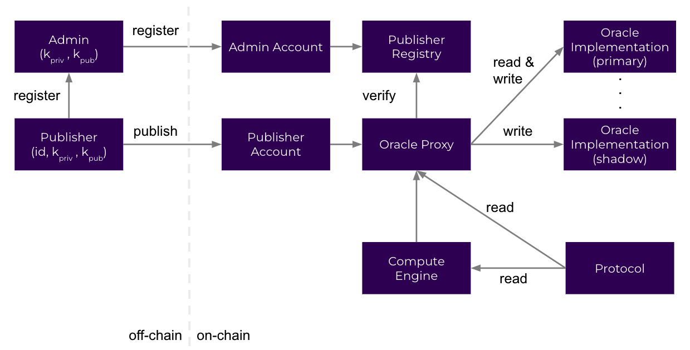

# Technical Deep Dive

### Architecture

The Empiric Oracle consists of three smart contracts, that each play a role in making the oracle easy to use and robust.

The first is the Publisher Registry, which is the most static. This is designed to be updated extremely infrequently because its state should be permanent (each publisher and their address). This is currently an ownable contract but will become permissionless as Empiric decentralizes.

The second is the Oracle Controller, which is also designed to be updated only as frequently as absolutely necessary. This is the contract which protocols use, and the one to which publishers publish. In the background, it coordinates the Publisher Registry and the Oracle Implementation(s).

The third contract type is Oracle Implementation which contains the logic for storing and aggregating specific key/value data streams. Oracle Implementations can be updated frequently by simply adding them to the Oracle Controller's list of implementation addresses. While there can be many Oracle Implementations to all of which the Oracle Controller write data being published to it, there can be only one primary Oracle Implementation, which is where the Oracle Controller fetches results from when other smart contracts ask it to.

### Deployed Contracts

On Starknet Alpha-Goerli (testnet), the contracts are currently deployed at the following addresses:

| Contract                       | Voyager                                                                                                           | Address                                                                                    |
| ------------------------------ | ----------------------------------------------------------------------------------------------------------------- | ------------------------------------------------------------------------------------------ |
| PublisherRegistry              | [Link](https://goerli.voyager.online/contract/0x07e05e4dea8a62988d9a06ea47bdac34c759a413db5b358e4a3a3d691d9d89e4) | `0x0743e8140a56d5ee9ed08eb77a92bcbcf8257da34ab2a2ee93110709e61ab11a`                       |
| OracleController               | [Link](https://goerli.voyager.online/contract/0x012fadd18ec1a23a160cc46981400160fbf4a7a5eed156c4669e39807265bcd4) | `0x012fadd18ec1a23a160cc46981400160fbf4a7a5eed156c4669e39807265bcd4`                       |
| OracleImplementation (primary) | [Link](https://goerli.voyager.online/contract/0x05a88457f9292d0596090300713e80724631024e7a92989302d458271c98cad4) | 
<code>0x05a88457f9292d0596090300713e80724631024e7a92989302d458271c98cad4</code> 
 |
